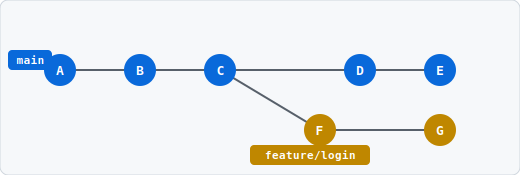
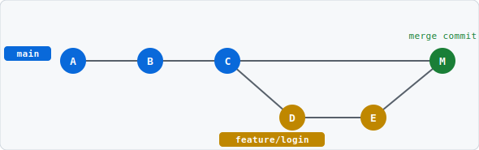
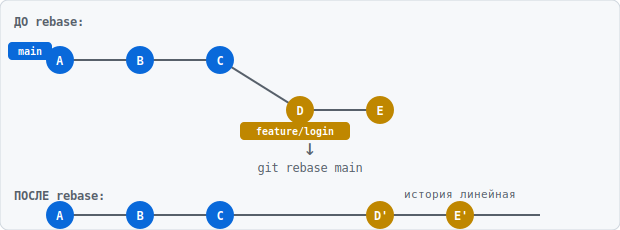

# 🌿 Урок 5: Ветки — работаешь без страха

> 🎯 **TL;DR:** `git switch -c feature/моя-фича` → пишешь код → коммитишь → `git switch main` → `git merge feature/моя-фича`. Готово, не сломал продакшн.

---

## 🤔 Что такое ветки и зачем они нужны?

Представь: у тебя есть работающий сайт в `main`. Тебе нужно добавить новую фичу. Если писать прямо в `main` — и фича сырая, и прод сломан. Все страдают.

**Ветки решают это.** Ты создаёшь параллельную вселенную (`feature/login`), пишешь там что угодно, и только когда всё готово и протестировано — сливаешь обратно в `main`.



> *Синие кружки — коммиты в `main`. Оранжевые — в `feature/login`. Обе ветки живут параллельно и не мешают друг другу.*

> *Ветки бесплатные и быстрые. В Git создать ветку — это буквально одна команда и доля секунды. Создавай ветку на каждую задачу. Это не оверхед, это правильный стиль работы.*

---

## 🛠️ Основные команды для веток

> *Раньше для всего юзали `git checkout`. Это старый способ, он ещё работает, но с Git 2.23 (2019) появились специальные команды `git switch` и `git restore`. Учи новый синтаксис — он понятнее.*

```powershell
git branch
# Показать все локальные ветки (* — где ты сейчас)

git branch -a
# Показать все ветки включая удалённые

git switch main
# Переключиться на ветку main

git switch -c feature/login
# Создать новую ветку И сразу переключиться на неё
# -c = create (старый аналог: git checkout -b feature/login)

git branch -d feature/old
# Удалить ветку (только если уже смержена)

git branch -D feature/old
# Удалить ветку принудительно (даже если не смержена)
# ☠️ Данные потеряются если не запушил
```

---

## 🔄 Основной workflow с ветками

Вот как выглядит нормальная работа над задачей:

```powershell
# 1. Убеждаемся что main актуальный
git switch main
git pull
# Тут важно: всегда делай pull перед созданием ветки
# Иначе твоя ветка будет отставать от реальности

# 2. Создаём ветку с понятным именем
git switch -c feature/user-registration
# Соглашение по именам:
# feature/название — новая фича
# fix/название — исправление бага
# hotfix/название — срочный фикс в проде
# refactor/название — рефакторинг

# 3. Работаем, коммитим как обычно
git add .
git commit -m "feat: добавил форму регистрации"
git commit -m "feat: добавил валидацию email"
git commit -m "fix: исправил падение при пустом пароле"

# 4. Возвращаемся на main
git switch main

# 5. Сливаем нашу ветку
git merge feature/user-registration
# Git скажет что смержил — история сохраняется

# 6. Чистим за собой
git branch -d feature/user-registration
```

> *Называй ветки понятно. `feature/add-google-auth` лучше чем `feature/auth` и в 100 раз лучше чем `test2` или `ветка-дениса`.*

---

## 🔀 Merge vs Rebase — два способа слить

### Merge — простой и честный

```powershell
git switch main
git merge feature/login
# Создаёт "merge commit" — запись что две ветки слились
# История выглядит как настоящее дерево с развилками
```



> *Коммит M (зелёный) — это merge commit. У него два родителя: C из main и E из feature. История честно показывает что была отдельная ветка.*

### Merge с `--no-ff` — сохраняет структуру
```powershell
git merge --no-ff feature/login
# Всегда создаёт merge commit даже если можно было без него
# Видно что была отдельная ветка — удобно смотреть историю
```

### Rebase — чистый и красивый

```powershell
git switch feature/login
git rebase main
# "Переставляет" твои коммиты поверх свежего main
# История выглядит линейно — как будто всё шло последовательно
```



> *D и E стали D' и E' — содержимое то же, но они «переставлены» поверх C. История линейная, как будто ветки не было.*

> ⚠️ **Золотое правило rebase:** ребейзь только те ветки, которые видишь только ты. Если ветка уже запушена и кто-то другой её скачал — `git rebase` перепишет историю, и у коллеги сломается репа. Безопасная схема: ребейзь локально до первого `push`, после — только `merge`.

> *Если ты один на проекте — можешь юзать что хочешь. В команде обычно договариваются заранее. Классика: ребейз для локальной работы, мерж для финального слияния через PR.*

---

## 💥 Merge Conflicts — не паникуй, это нормально

Конфликт случается когда два человека (или две ветки) изменили один и тот же кусок кода. Git не знает какую версию оставить — просит тебя решить.

```powershell
git merge feature/login
# Auto-merging index.html
# CONFLICT (content): Merge conflict in index.html
# Automatic merge failed; fix conflicts and then commit the result.
```

Открой файл с конфликтом — увидишь такое:

```
<<<<<<< HEAD
<h1>Добро пожаловать на сайт</h1>
=======
<h1>Добро пожаловать, пользователь!</h1>
>>>>>>> feature/login
```

- `<<<<<<< HEAD` до `=======` — это твоя версия (текущая ветка)
- `=======` до `>>>>>>>` — это версия из мерджимой ветки

Ты выбираешь что оставить (или комбинируешь), убираешь маркеры `<<<`, `===`, `>>>`, сохраняешь:

```powershell
git add index.html
git commit
# Git предложит сообщение "Merge branch 'feature/login'" — можешь принять
```

> *VS Code и другие редакторы подсвечивают конфликты и дают кнопки "Accept Current / Accept Incoming / Accept Both". Юзай их — удобнее чем вручную.*

---

## 🏋️ Задание к уроку

1. ✅ Создай ветку `feature/about` командой `git switch -c feature/about`
2. ✅ Добавь файл `about.html` с каким-нибудь содержимым
3. ✅ Сделай 2-3 коммита
4. ✅ Слей ветку в `main` через `git merge --no-ff feature/about`
5. ✅ Намеренно создай конфликт: измени одну строку в `main` и в фича-ветке, попробуй слить

---

## 🏠 Домашнее задание

- Попробуй `git rebase` вместо `merge` — посмотри как выглядит история через `git log --oneline --graph --all`
- Сравни результат: с merge получается дерево, с rebase — прямая линия

---

## 💀 Типичные ошибки новичка

| Ошибка | Что происходит |
|--------|---------------|
| Пишешь код прямо в `main` | Сломал прод, тимлид недоволен |
| Создаёшь ветку от старого `main` | Мержишь в актуальный — тонна конфликтов |
| Называешь ветку `test` или `ветка1` | Никто не понимает что там происходит |
| Не удаляешь ветки после мержа | Репа обрастает мусором из 50 веток |
| `git rebase` на общей ветке которую видят другие | Переписываешь историю, у коллег сломается репа |

