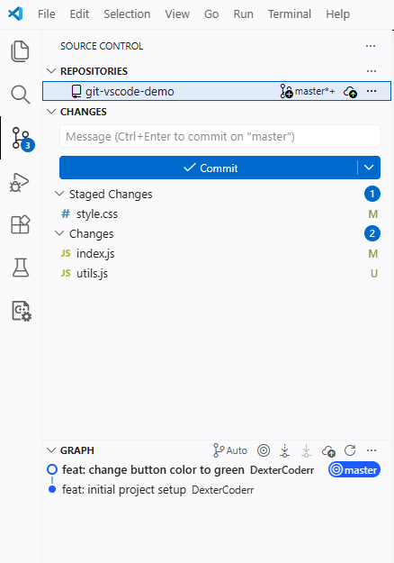
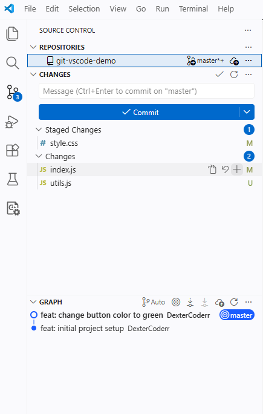
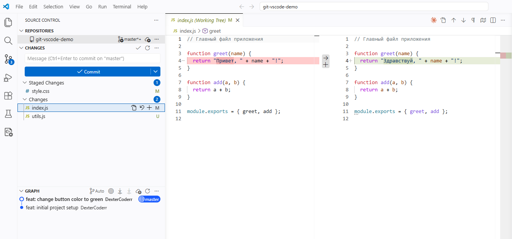
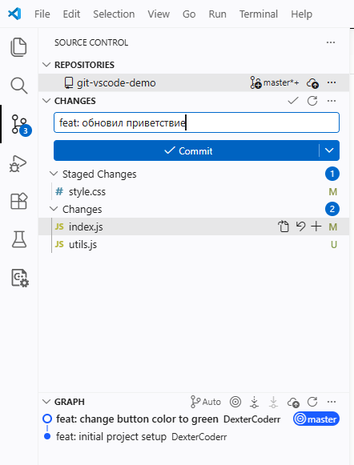
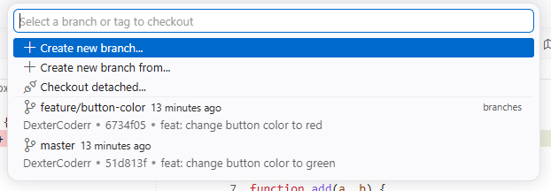
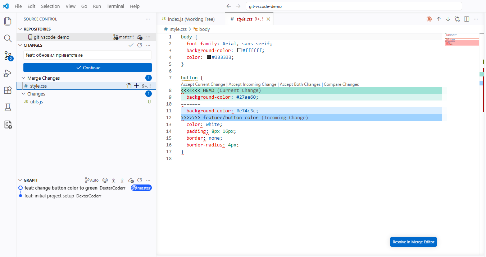

# 🖥️ Урок 7: Git в VSCode — всё то же самое, но кликами

> 🎯 **TL;DR:** Всё что ты делал в терминале — `add`, `commit`, `diff`, ветки, конфликты — VSCode умеет делать мышкой. Это не замена терминалу, это второй способ делать то же самое.

---

Ты уже знаешь команды. Ты уже коммитил через терминал и не умер. Теперь секрет который не говорят вслух:

**Большинство разработчиков делают рутинный Git мышкой прямо в редакторе.** А терминал открывают только для сложных вещей — rebase, cherry-pick, разруливание серьёзных конфликтов.

VSCode умеет в Git из коробки — без плагинов, без настройки. Просто открываешь папку с репозиторием — и всё работает.

---

## 📍 Где это всё живёт — Source Control панель

Нажми **Ctrl+Shift+G** (или кликни на иконку веток в левом сайдбаре):

Что видишь:
- **Staged Changes** — файлы добавленные в индекс, готовые к коммиту (`git add` уже сделан)
- **Changes** — файлы изменённые, но ещё не добавленные в индекс
- **M** — Modified, изменён; **U** — Untracked, Git не знает про этот файл
- **Commit** — кнопка закоммитить всё что в Staged Changes
- Стрелка **▾** рядом с Commit — выпадает меню с вариантами (Commit & Push, Commit & Sync)

---

## ➕ Stage — добавляем файлы в индекс

В терминале ты делал `git add файл`. В VSCode — наводишь на файл и жмёшь **+**:

Видишь иконки которые появились справа на `index.js`:
- 📄 — открыть файл
- ↺ — отменить изменения (`git restore`)
- **+** — добавить в индекс (`git add`)

После клика на **+** файл переедет из **Changes** в **Staged Changes**.

> *Ты можешь добавить только `index.js`, а `utils.js` оставить на потом. Именно за это и нужен двухшаговый процесс — один коммит про одно изменение, не всё подряд.*

---

## 🔍 Diff — смотрим что изменилось

Кликни на любой файл в списке Changes — откроется diff прямо в редакторе:

Слева — было, справа — стало. Красный фон — удалено, зелёный — добавлено. То же самое что `git diff` в терминале, только сразу глазами.

> *Смотри diff перед каждым коммитом. 10 секунд — и не закоммитишь случайный `console.log` в продакшн.*

---

## 📸 Commit — коммитим через интерфейс

Напиши сообщение коммита в поле сверху и нажми **Commit**:

Стрелка **▾** рядом с кнопкой открывает варианты:
- **Commit** — просто закоммитить
- **Commit & Push** — закоммитить и сразу запушить
- **Commit & Sync** — закоммитить, подтянуть чужие изменения, запушить

> *"Commit & Sync" удобен в командной работе — делает `pull` + `push` одним кликом. Но если есть конфликты, придётся разруливать.*

---

## 🌿 Ветки — переключаемся без терминала

Кликни на название текущей ветки рядом с именем репозитория — откроется список:

Видишь:
- **+ Create new branch...** — создать новую ветку
- Список существующих веток с последним коммитом и хешем
- Кликаешь на ветку — переключаешься мгновенно (`git switch`)

---

## ⚔️ Конфликты — это не страшно когда видишь их глазами

В терминале конфликт выглядит как три куска непонятного текста с тегами `<<<` и `>>>`. В VSCode та же ситуация выглядит по-человечески:

Вверху конфликтного блока появляются ссылки:
- **Accept Current Change** — оставить твоё изменение (зелёный блок, HEAD)
- **Accept Incoming Change** — взять чужое изменение (синий блок)
- **Accept Both Changes** — оставить оба варианта
- **Compare Changes** — посмотреть diff

Кнопка **Resolve in Merge Editor** внизу справа — открывает трёхпанельный редактор для сложных конфликтов.

> *Большинство конфликтов решаются за 30 секунд когда видишь их вот так. В терминале та же операция занимает 5 минут нервных поисков тегов `<<<`.*

---

## 📝 Задание к уроку

1. ✅ Открой свой `git-practice` в VSCode
2. ✅ Измени пару файлов и найди их в Source Control панели
3. ✅ Добавь один файл через **+** и посмотри как он переехал в Staged Changes
4. ✅ Сделай коммит через интерфейс — убедись что сообщение нормальное
5. ✅ Кликни на изменённый файл и изучи diff — найди что именно изменилось

---

## 💀 Типичные ошибки

| Ошибка | Что происходит |
|--------|----------------|
| Нажал "Commit" без сообщения | VSCode ругается, коммита нет — хорошо что не пропустил |
| Нажал "Commit & Sync" с конфликтами | VSCode остановится и покажет конфликты, не страшно |
| Не смотришь diff перед коммитом | Коммитишь лишнее: дебаг-код, console.log, случайные изменения |
| Думаешь что VSCode-кнопки — это что-то другое | Это буквально те же git-команды, просто без терминала |

---

> **Важно:** VSCode не заменяет знание команд — он их прячет за кнопками. Поэтому ты сначала учил терминал. Теперь ты понимаешь что происходит за каждым кликом — это и есть разница между "нажал кнопку" и "знаю что делаю".

